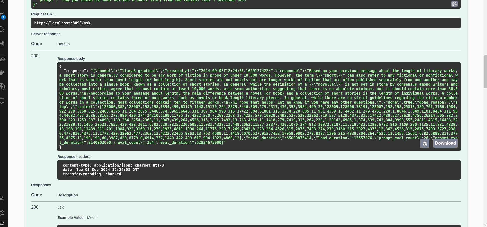
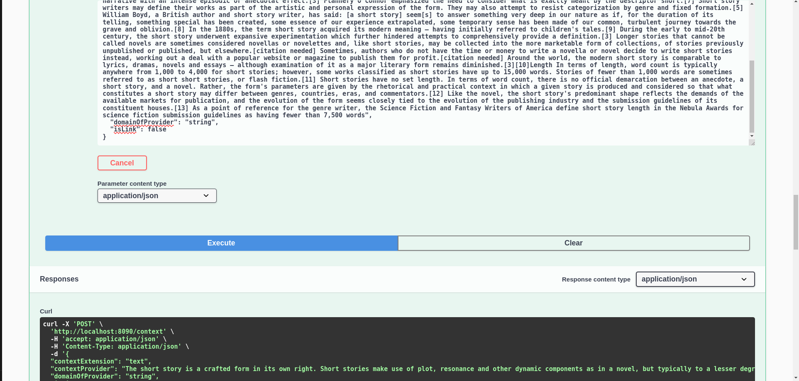

# iLLM-backend

Entire iLLM backend

## Demo

Ask API: speak to LLM



Context API: provide context via pdf, docx, txt & plain text



## API Docs

```sh
http:localhost:8090/swagger/index.html
```
